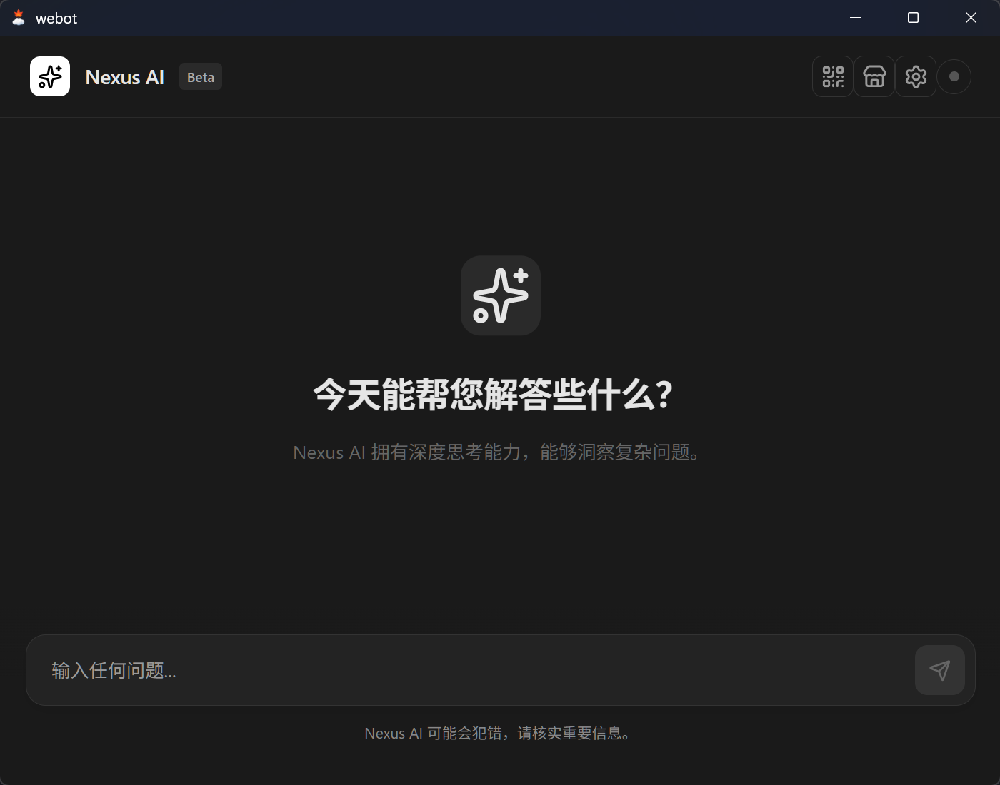

# Webot

超轻量化 agent 桌面应用。Tauri 2 + React + Rust，直接调用 OpenAI 兼容 LLM API，支持 SSE 流式对话。

同时集成微信通道（ilinkai API），支持扫码登录、自动回复、媒体文件收发。

## 快速开始

```bash
cd webot
npm install
npm run tauri dev
```

效果图


## 技术栈

- **前端**: React 18 + TypeScript + Vite
- **后端**: Rust (Tauri 2)
- **LLM**: OpenAI 兼容 API（流式/非流式）
- **微信**: ilinkai API 长轮询
